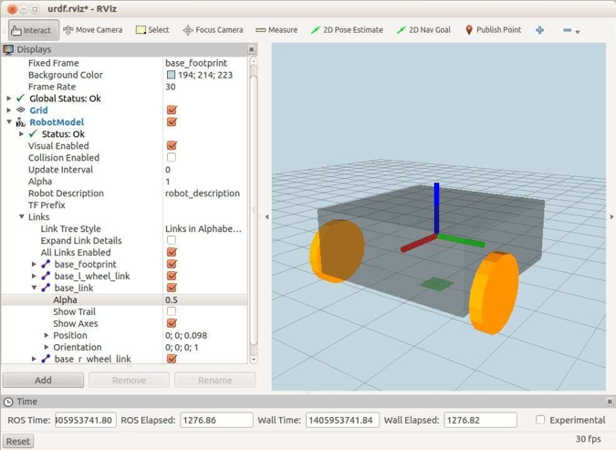
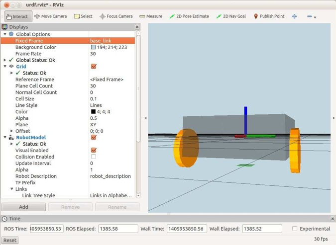

# 4.1.2 Базовый файл URDF / Xacro.

Давайте теперь посмотрим на файл URDF/Xacro, который использовался выше для загрузки блочной модели базы робота. Файл называется _base.urdf.xacro_ и находится в каталоге _rbx2\_description/urdf/box\_robot_. Мы рассмотрим файл в разделах начиная сверху:

```text
1     <?xml version="1.0"?>
2     <robot name="base" xmlns:xacro="http://ros.org/wiki/xacro">
```

Все файлы URDF / Xacro начинаются с этих двух открывающих тегов. Все после тега  будет определять наш компонент, и мы закроем весь файл с завершающим тегом _&lt;/ robot&gt;_.

```text
4     <!-- Define a number of dimensions using properties -->
5     <property name="base_size_x" value="0.30" />
6     <property name="base_size_y" value="0.30" />
7     <property name="base_size_z" value="0.12" />
8     <property name="wheel_length" value="0.02032" />
9     <property name="wheel_radius" value="0.06191" />
10    <property name="wheel_offset_x" value="0.09" />
11    <property name="wheel_offset_y" value="0.17" />
12    <property name="wheel_offset_z" value="-0.038" />
13
14    <property name="PI" value="3.1415" />
```

Раздел свойств позволяет нам назначать все измерения и смещения переменным, которые затем могут использоваться в остальной части файла. Если изменения будут внесены в робота позднее, просто измените эти значения соответствующим образом. При установке значений свойств учитывайте следующие моменты:

·      линейные размеры указаны в метрах

·      угловые значения приведены в радианах

·      при указании параметров _xyz_ оси координат выровнены по x, указывая направление робота вперед, yуказывает влево, а z указывает вверх. Например, свойство _wheel\_offset\_y_ выше указывает расстояние, на которое каждое колесо установлено слева или справа от центральной линии робота.

·      при назначении параметров вращения _rpy_ \(roll, pitch, yaw\) параметр roll \(r\) вращается вокруг оси x, шаг \(p\) - вокруг оси y, а yaw \(y\) вращается вокруг оси z.

Чтобы увидеть оси, прикрепленные к базе в RViz, установите значение **Alpha** для _base\_link_ примерно на _0,5_, например:



Здесь мы установили значение **Alpha** равным 0,5 для _base\_link_ и отметили поле рядом с **Show Axes**. _RViz_ всегда использует один и тот же код цвета для осей кадра, прикрепленных к ссылке: красный для оси x, зеленый для y и синий для z.

Теперь вернемся к нашему обсуждению файла _base.urdf.xacro_. Вот блок для колеса:

```text
16     <!-- define a wheel -->
17     <macro name="wheel" params="suffix parent reflect color">
18     <joint name="${parent}_${suffix}_wheel_joint" type="continuous">
19     <axis xyz="0 0 1" />
20     <limit effort="100" velocity="100"/>
21     <safety_controller k_velocity="10" />
22     <origin xyz="${wheel_offset_x} ${reflect*wheel_offset_y} $
{wheel_offset_z}" rpy="${reflect*PI/2} 0 0" />
23     <parent link="${parent}_link"/>
24     <child link="${parent}_${suffix}_wheel_link"/>
25     </joint>    
26     <link name="${parent}_${suffix}_wheel_link">
27     <visual>
28     <origin xyz="0 0 0" rpy="0 0 0" />
29     <geometry>
30     <cylinder radius="${wheel_radius}" length="${wheel_length}"/>
31     </geometry>
32     <material name="${color}" />
33     </visual>
34     </link>
35     </macro>
```

Колесо определяется как макрос, так что мы можем использовать его для каждого колеса без повторения _XML_. Мы не будем подробно описывать синтаксис, так как он уже описан URDF tutorials. Однако обратите внимание на использование параметра _reflect,_ который принимает значения _1_ или _-1_ для левой и правой сторон соответственно и позволяет нам переворачивать колесо и знак смещения y.

```text
37     <!-- The base xacro macro -->
38     <macro name="base" params="name color">
39     <link name="${name}_link">
40     <visual>
41     <origin xyz="0 0 0" rpy="0 0 0" />
42     <geometry>
43     <box size="${base_size_x} ${base_size_y} ${base_size_z}" />
44     </geometry>
45     <material name="${color}" />
46     </visual>
47     <collision>
48     <origin xyz="0 0 0" rpy="0 0 0" />
49     <geometry>
50     <box size="${base_size_x} ${wheel_offset_y*2 + wheel_length} $
{base_size_z}" />
51     </geometry>
52     </collision>
53     </link>
54     </macro>
```

Далее мы определим макрос для самой базы. В этом случае мы используем простую прямоугольную геометрию для компонента , включающую параметры, определенные в верхней части файла. Для блока  мы определили более широкую рамку для колес. Это обеспечивает запас прочности вокруг робота, чтобы предотвратить попадание колес на препятствия. \(Примечание: если колеса вашего робота лежат внутри периметра основания, вы можете просто использовать тот же блок, что и для визуального компонента.\)

```text
56     <link name="base_footprint">
57     <visual>
58     <origin xyz="0 0 0" rpy="0 0 0" />
59     <geometry>
60     <box size="0.05 0.05 0.001" />
61     </geometry>
62     <material name="TransparentGreen" />
63     </visual>
64     </link>
65
66     <joint name="base_joint" type="fixed">
67     <origin xyz="0 0 ${base_size_z/2 - wheel_offset_z}" rpy="0 0 0" /> 68
<parent link="base_footprint"/>
69     <child link="base_link" />
70     </joint>

```

Здесь мы определяем ссылку _base\_footprint_ и фиксированное соединение, которое определяет ее отношение к _base\_link_. Как объяснено в следующем разделе, роль base\_footprint по существу состоит в определении высоты основания над землей. Как вы можете видеть выше, соединение между опорой и основанием поднимает основание на величину, рассчитанную по высоте основания и смещению по оси z колес. Чтобы понять, почему мы должны поднять робота на величину _base\_size\_z / 2,_ измените **Fixed Frame** в _RViz_ на _/base\_link_. Если вы используете мышь, чтобы сместить точку обзора так, чтобы вы смотрели на землю почти с ребра, изображение должно выглядеть так:



Обратите внимание, как источник компонента URDF-блока расположен в центре блока; то есть на высоте _base\_size\_z / 2_ метра над дном робота. Следовательно, фиксированное соединение между рамкой _/base\_footprint_ \(которая опирается на землю\) и рамкой _/base\_link_ должно включать перемещение в направлении z на расстояние _base\_size\_z/2_ метра, чтобы поднять дно робота. Наконец, давайте добавим два ведущих колеса к роботу:

```text
72     <!-- Add the drive wheels -->
73     <wheel parent="base" suffix="l" reflect="1" color="Orange"/>
74     <wheel parent="base" suffix="r" reflect="-1" color="Orange"/>

```

Здесь мы дважды вызываем макрос  с параметром _reflect_, установленным сначала _1_ для левого колеса и _-1_ для правого, чтобы убедиться, что колеса установлены на противоположных сторонах основания. Параметр суффикса заставляет макрос  давать каждой ссылке на колесо уникальное имя.


