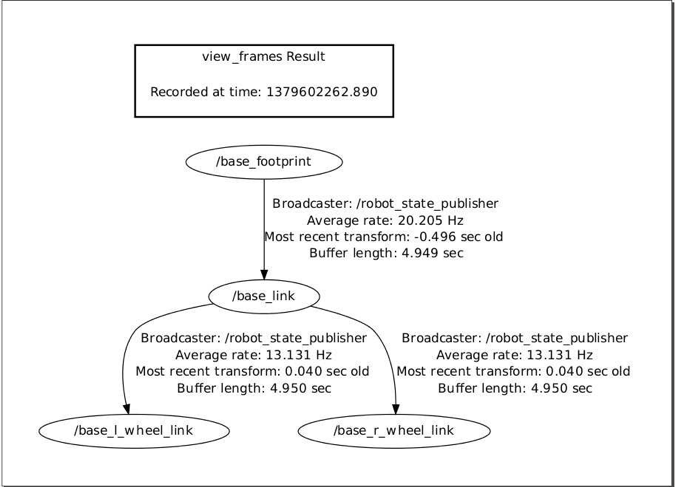

# 4.1.5 Просмотр дерева трансформации робота.

Чтобы просмотреть изображение _tf_-дерева робота, используйте утилиту _view\_frames_:

```text
$ cd ~
$ rosrun tf view_frames
```

Это создаст файл PDF с именем frames.pdf в текущем каталоге. Его можно просмотреть с помощью любого PDF-ридера, например evince:

```text
$ evince frames.pdf
```



Для нашего базового робота мы видим, что дерево преобразований довольно простое. Каждая ссылка в нашей модели URDF отображается как узел в дереве, в то время как дуги представляют преобразования координат от одной ссылки к другой. Корнем дерева является ссылка _/base\_footprint_, которая, в свою очередь, соединяется с _/base\_link_. Затем _/base\_link_ разветвляется на левое и правое ведущие колеса.


