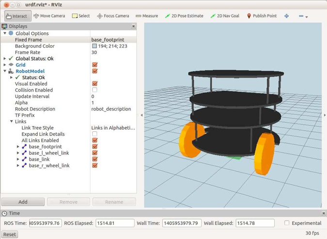
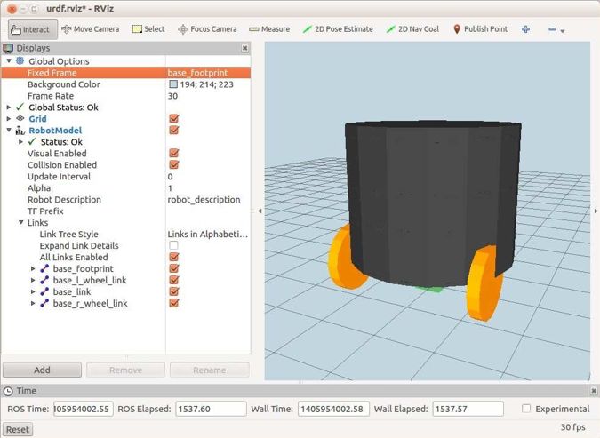
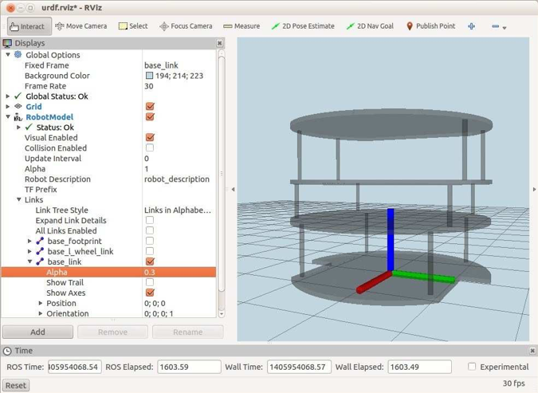

# 4.1.6 Использование сетки для базы.

Если у вас есть 3D-сетка для вашей базы и/или колес, вы можете использовать их вместо модели с коробкой и цилиндром. Пакет _rbx2\_description_ включает в себя STL-сетки для компонентов Pi Robot, которые будут использоваться в качестве примера. Вы можете найти файлы STL в каталоге _rbx2\_description/meshes/pi\_robot_. Файлы сетки были созданы в Google Sketchup и очищены с помощью Meshlab. \(См. Следующий раздел по упрощению сетки.\) Файлы Sketchup находятся в каталоге _rbx2\_description/sketchup/pirobot_.

Чтобы вызвать только базу, сначала прервите любой другой файл запуска URDF, который вы могли запустить из предыдущего раздела, а затем выполните следующее:

```text
rbx2_description pi_robot_base_only.launch
```

Если _RViz_ еще не запущен:

```text
$ rosrun rviz rviz -d `rospack find rbx2_description`/urdf.rviz
```

Представление в _RViz_ должно выглядеть примерно так:



\(Не забудьте установить флажок рядом с дисплеем **RobotModel**, если вы все еще видите ранее загруженную модель.\)

Чтобы увидеть, как сетка была включена в модель URDF, взгляните на файл _pi\_base.urdf.xacro_ в каталоге _rbx2\_description/urdf/pi\_robot_.

Файл практически идентичен блочной модели базы с несколькими ключевыми отличиями. Вот ключевые строки свойств и блок, определяющий базовый макрос:

```text
<property name="base_radius" value="0.152" />
<property name="base_height" value="0.241" /> 
<property name="ground_clearance" value="0.065" />

<property name="base_mesh_scale" value="0.0254" /> 

<property name="PI" value="3.1415" />

<!-- The base xacro macro -->
<macro name="base" params="name color">
    <link name="${name}_link"> 
        <visual>
            <origin xyz="0 0 0" rpy="0 0 ${PI/2}" /> 
            <geometry>
            <mesh
 filename="package://rbx2_description/meshes/pi_robot/pi_robot_base.stl" scale="$ 
 {base_mesh_scale} ${base_mesh_scale} ${base_mesh_scale}" />
            </geometry>
            <material name="${color}" /> 
        </visual>
        <collision>
            <origin xyz="0 0 ${base_height/2}" rpy="0 0 0" /> 
            <geometry>
                <cylinder radius="${base_radius}" length="${base_height}"/> 
            </geometry>
      </collision>
    </link>
</macro>
```

Ключевая строка выделена жирным шрифтом выше. Вместо того, чтобы определять простое поле \(или в данном случае цилиндр\) для визуального компонента, мы загружаем трехмерную модель основания, используя тег _&lt;mesh&gt;_. В качестве параметра имени файла задается путь к пакету ROS соответствующего файла, в данном случае это файл _pi\_robot\_base.stl_ в каталоге _rbx2\_description/meshes/pi\_robot_. Поскольку сетки, созданные в программах CAD, не обязательно будут использовать метры в качестве базовой единицы, мы также используем параметр масштаба, который принимает три значения для множителей _x, y и z._ \(Масштаб почти всегда будет одинаковым во всех трех направлениях.\) Базовая сетка Пи была создана в Google Sketchup, и получается, что соответствующий масштабный коэффициент равен _0,0254_. Это значение, установленное для свойства _base\_mesh\_scale_ в верхней части файла.

Обратите внимание, что мы используем простой цилиндр, а не сетку в блоке _&lt;collision&gt;_ . Причина в том, что параметры столкновения используются другими пакетами ROS, такими как стек навигации, для проверки того, что робот не собирается сталкиваться с препятствием. Гораздо быстрее выполнить проверку столкновения с простыми геометрическими фигурами, такими как коробки и цилиндры, чем использовать трехмерную сетку, которая может иметь тысячи граней. Пока более простая форма охватывает визуальную сетку, она также служит для проверки столкновений. Также обратите внимание, что мы установили компонент z для цилиндра столкновения в _base\_height/2_. Это потому, что координатная рамка базовой сетки фактически прикреплена к нижней части сетки, а не к середине, как будет объяснено ниже.

Чтобы увидеть цилиндр столкновения в _RViz_, просто установите флажок рядом с **Collision Enabled** под **RobotDisplay**, и представление должно выглядеть следующим образом:



Обратите внимание, как цилиндр столкновения полностью охватывает основную сетку. Переключение флажка **Collision Enabled** - хороший способ убедиться, что формы столкновения правильно расположены и имеют размеры. В этом случае вам может быть интересно, будут ли колеса представлять опасность столкновения, поскольку они торчат из основного цилиндра. Помните, что каждое колесо имеет свою собственную огибающую столкновения, которую мы определили как ту же форму, что и само колесо. Так что в этом смысле колеса накрыты. Если по какой-то причине вы хотели быть особенно осторожными, вы можете увеличить размер цилиндра столкновения с основной поверхностью, чтобы также охватить колеса. Однако это также может помешать роботу перемещаться через узкие промежутки.

Вычисление дорожного просвета для робота зависит от того, где сетка определяет его происхождение. Чтобы увидеть оси для базовой сетки Pi Robot, установите параметры в _RViz_ следующим образом:

·       **снимите** флажок **«Collision Enabled»**

·       установите **Fixed Frame** на /base\_link в разделе **Global Options** 

·      откройте список **Links** под дисплеем **RobotModel**, установите значение **Alfa** канала для base\_link примерно на 0,3 и установите флажок **Show Axes**

·      **снимите** флажки в разделе **Links** для всех ссылок, кроме _base\_link_

Полученное представление в _RViz_ должно выглядеть примерно так:



Как вы можете видеть, эта конкретная сетка определяет свое начало в центре нижней части основания. \(Вспомните, что компонент блока или цилиндра имеет начало в середине компонента.\) К счастью, оси ориентированы так, как мы хотим, с осью X, направленной в прямом направлении робота.

Теперь можно увидеть, что дорожный просвет робота представляет собой просто разницу между радиусом колеса и смещением оси z. Таким образом, определение _&lt;joint&gt;_ для ссылки _base\_footprint_ выглядит следующим образом:

```text
<joint name="base_joint" type="fixed">
    <origin xyz="0 0 ${wheel_offset_z - wheel_radius}" rpy="0 0 0" /> 
    <parent link="base_link"/>
    <child link="base_footprint" />
</joint>
```

Модель URDF / Xacro верхнего уровня, которая включает в себя основу сетки, хранится в файле _pi\_robot\_base\_only.xacro_ в каталоге _rbx2\_templates/urdf/pi\_robot_ и выглядит следующим образом:

```text
<?xml version="1.0"?> 
<robot name="pi_robot">
        <!-- Include all component files -->
        <xacro:include filename="$(find rbx2_description)/urdf/materials.urdf.xacro" 
/>

        <xacro:include filename="$(find rbx2_description)/urdf/pi_base.urdf.xacro" />
        
        <!-- Add the base and wheels --> 
        <base name="base" color="Black"/>

</robot>
```

Как видите, файл довольно прост. Сначала мы добавляем имя нашего робота в открывающий тег _&lt;robot&gt;_. Затем мы включаем два файла макроса, файл материалов, который определяет различные цвета, и базовый файл макроса, который мы только что создали. Наконец, мы добавляем базу роботу, вызывая макрос _&lt;base&gt;_, и желаемый цвет.

