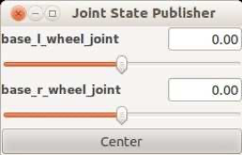
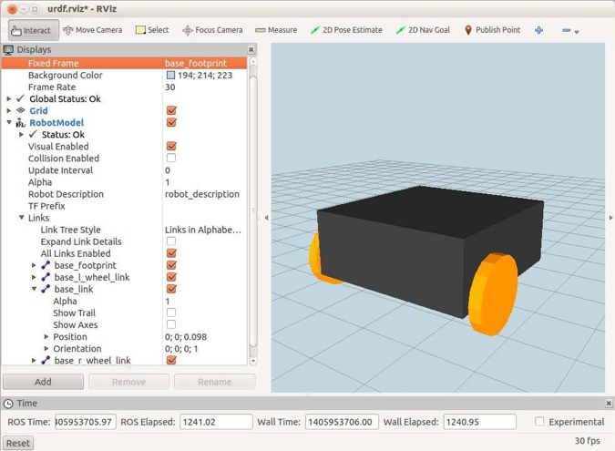

# 4.1 Начнем с базы и колёс

Все модели роботов в ROS должны начинаться с базы, а самые простые роботы - не что иное, как просто база. Если вы используете модель сетки \(STL или Collada\), колеса могут быть фиксированной частью модели или отдельными сетками. Нет никакой реальной необходимости заставлять колеса вращаться вокруг соединения, но некоторые пакеты ROS \(например, MoveIt!\) действительно предполагают, что колеса являются отдельными компонентами, прикрепленными к основанию в соединениях \(которые могут быть фиксированными или непрерывными\).

Если туловище вашего робота зафиксировано на основании и не имеет движущихся частей, его также можно включить в тот же файл, что и основание. Однако в следующих примерах мы будем рассматривать его в качестве отдельного компонента. Таким образом, вы можете изменить туловище позже. Например, вы можете добавить линейный привод, чтобы он двигался вверх и вниз.

Прежде чем мы рассмотрим файлы URDF, давайте удостоверимся, что можем просматривать их в RViz. Мы будем использовать эту процедуру на протяжении всей главы для проверки внешнего вида модели.

Для начала запустите файл _box\_robot\_base\_only.launch_ в пакете _rbx2\_description_:

```text
$ roslaunch rbx2_description box_robot_base_only.launch
```

Вы должны увидеть небольшое окно с именем «Joint State Publisher» с двумя ползунковыми регуляторами, по одному на каждое колесо привода:



Далее, запустите RViz с помощью включенного файла конфигурации urdf.rviz:

```text
$ rosrun rviz rviz -d `rospack find rbx2_description`/urdf.rviz
```

Представление в RViz должно выглядеть примерно так:



Обратите внимание, как для **Fixed Frame** установлено значение _/ base\_footprint_. Имейте это в виду, когда мы посмотрим на определение базы URDF позже.

**ПРИМЕЧАНИЕ**. Поскольку в этой главе мы загружаем различные модели URDF, \(обычно\) нет необходимости перезапускать RViz, чтобы увидеть изменения. Вместо этого просто установите флажок рядом с дисплеем **RobotModel**. \(Под «переключением флажка» мы подразумеваем снятие флажка и повторную проверку.\) Это должно обновить модель до последней версии, загруженной на сервер параметров. Если модель уже загружена, изменения в определениях соединений обычно обнаруживаются RViz автоматически, тогда как изменения в параметрах связи требуют переключения флажка. Иногда, особенно при работе с сетками, RViz может застрять в ранее загруженной модели или отображать что-то не того цвета. В этих случаях перезапуск RViz должен решить проблему.


