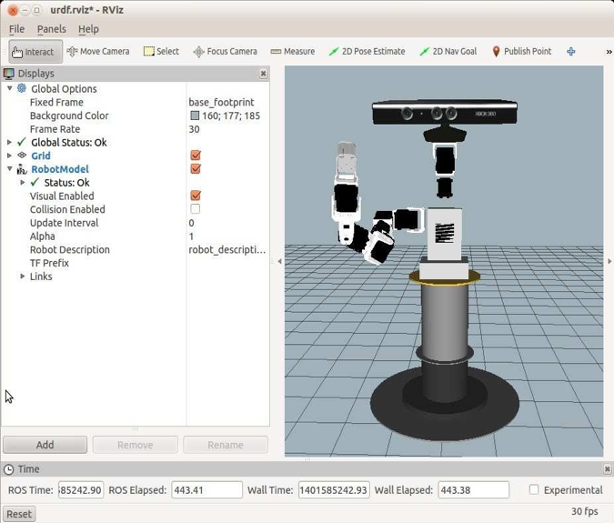
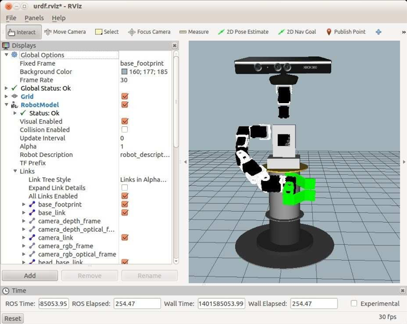

# 4.11 Настольный робот-манипулятор 1-Arm Pi

Иногда приятно иметь робота, или хотя бы модель робота, который просто сидит на столешнице и позволяет сосредоточиться на голове и руке \(руках\). Модель именно такого робота можно найти в каталоге _rbx2\_description/urdf/pedestal\_pi_. Существует две версии робота, одна с захватом _\(pedestal\_pi\_with\_gripper.xacro_\) и другая с простой веслообразной рукой без движущихся пальцев._\(pedestal\_pi\_no\_gripper.xacro\)._ Для просмотра модели без захвата запустите команду:

```text
$ roslaunch rbx2_description pedestal_pi_no_gripper.launch
```

Если RViz все еще не работает:

```text
$ rosrun rviz rviz -d `rospack find rbx2_description`/urdf.rviz
```

\(Если _RViz_ все еще работает с предыдущей сессии, установите флажок рядом с дисплеем **RobotModel**, чтобы перезагрузить модель\). Изображение должно выглядеть так:



Чтобы загрузить модель с помощью захвата, завершите предыдущий файл запуска и выполните команду:

```text
$ roslaunch rbx2_description pedestal_pi_with_gripper.launch
```

Если RViz все еще не работает:

```text
$ rosrun rviz rviz -d `rospack find rbx2_description`/urdf.rviz
```

\(Если RViz все еще работает с предыдущей сессии, установите флажок рядом с дисплеем **RobotModel**, чтобы перезагрузить модель\). Изображение должно выглядеть так:



Поучительно отметить, что с этой моделью "Pedestal Pi" используются те же _URDF/Xacro_-файлы для руки и захвата, что и с мобильной версией Pi Robot. Мы просто прикрепляем руку и захват к различным базовым моделям для двух роботов.


