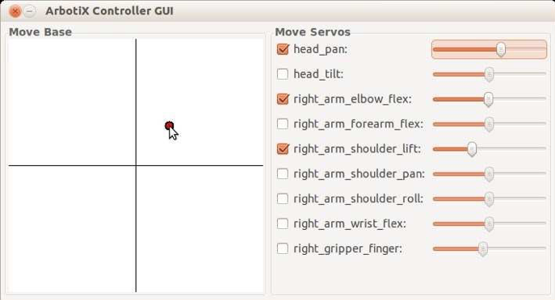

# 4.12.1 Фальшивый коробчатый робот.

Для запуска симулятора ArbotiX с помощью одноручного бокс-робота используйте файл запуска _fake\_box\_robot\_with\_gripper.launch в rbx2\_bringup/launch_:

```text
$ roslaunch rbx2_bringup fake_box_robot_with_gripper.launch
```

Вывод на экран должен выглядеть примерно так:

```text
process[arbotix-1]: started with pid [28030] 
process[right_gripper_controller-2]: started with pid [28042] 
process[robot_state_publisher-3]: started with pid [28044]
[INFO] [WallTime: 1379768229.756858] ArbotiX being simulated. 
[INFO] [WallTime: 1379768230.099804] Started FollowController 
(right_arm_controller). Joints: [
'right_arm_shoulder_pan_joint', 'right_arm_shoulder_lift_joint', 
'right_arm_shoulder_roll_joint', 'right_arm_elbow_flex_joint', 
'right_arm_forearm_flex_joint', 'right_arm_wrist_flex_joint'] on C1
[INFO] [WallTime: 1379768230.117023] Started FollowController 
(right_gripper_controller). Joints: ['right_gripper_finger_joint'] on C2 
[INFO] [WallTime: 1379768230.150616] Started DiffController 
(base_controller). Geometry: 0.26m wide, 4100.0 ticks/m.
```

Здесь мы видим, что запустили три узла: основной драйвер arbotix, драйвер для правого захвата и _robot\_state\_publisher_. Также мы видим линии INFO для двух совместных контроллеров траекторий \(называемых FollowControllers в пакете arbotix\), один для правого плеча и один для захвата\) и DiffController для базы привода дифференциала. Мы отложим обсуждение этих узлов и контроллеров до главы о MoveIt! и Arm Navigation. А пока давайте просто проверим, что мы можем двигать шарниры соответствующим образом.

Если RViz все еще запущен из предыдущего сеанса, завершите его сейчас и приведите его в конфигурационном файле _sim.rviz_ следующим образом:

```text
$ rosrun rviz rviz -d `rospack find rbx2_bringup`/sim.rviz
```

Обратите внимание, что в категории "**Global Options**" мы установили значение параметра Fixed Frame в _/odom_. Вспомните из тома 1, что нам нужно быть в кадре _/odom_, чтобы видеть движение робота при публикации команд Twist в теме _/cmd\_vel_.

Теперь откройте новый терминал и откройте утилиту с графическим интерфейсом ArbotiX:

```text
$ arbotix_gui
```

Должно появиться новое окно, которое выглядит следующим образом:



Используйте смоделированную дорожку слева, чтобы управлять роботом в RViz, захватив маленькую красную точку и перетаскивая ее вокруг. \(Если робот не появляется на экране, дважды проверьте, что Вы установили Фиксированный кадр в _/odom_ в категории Глобальные опции в RViz\). Чтобы переместить шарнир, установите флажок рядом с именем сервопривода, а затем используйте ползунок для его вращения.

_Arbotix\_gui_ - это хороший способ проверить основные функциональные возможности вашего робота. Перемещение красной точки на трековой панели публикует сообщения Twist на тему _/cmd\_vel_. Если параметры базового контроллера настроены правильно, то фальшивый робот должен двигаться ожидаемым образом.

Аналогичным образом, ползунок управления сервопривода может быть использован для проверки движения отдельных суставов. Эти элементы управления публикуют сообщение Float64, представляющее совместную позицию в радианах по теме / _joint\_name/command_. Например, ползунок с меткой _right\_arm\_shoulder\_lift_ публикует свое значение позиции на тема _/right\_arm\_shoulder\_lift\_joint/command_. При движении ползунка рука должна двигаться вверх или вниз у плечевого сустава.

Одиночные узлы _arbotix_ являются настоящими контроллерами, в отличие от совместного государственного издателя, который мы использовали в этой главе до сих пор, мы можем публиковать команды на соответствующие темы контроля для перемещения узлов. В первом томе мы уже видели, как перемещать базу фальшивого робота, публикуя команды Twist в теме _/cmd\_vel._ Теперь мы также можем перемещать суставы аналогичным образом.

Прекратите работу _arbotix\_gui_, если он все еще работает, а затем попробуйте следующие команды для перемещения головы и руки.

Например, чтобы повернуть голову на _90_ градусов \(_1.57 радиана_\) влево, выполните команду:

```text
$ rostopic pub -1 /head_pan_joint/command std_msgs/Float64 -- 1.57
```

Чтобы переместить руку в горизонтальное положение с помощью _the right\_arm\_shoulder\_lift\_joint_, попробуйте команду:

```text
$ rostopic pub -1 /right_arm_shoulder_lift_joint/command 
    std_msgs/Float64 -- -1.57
```

И переместить его обратно в положение покоя:

```text
$ rostopic pub -1 /right_arm_shoulder_lift_joint/command 
    std_msgs/Float64 -- 0.0
```

В последующих главах мы узнаем, как программно управлять суставами из наших собственных узлов.


