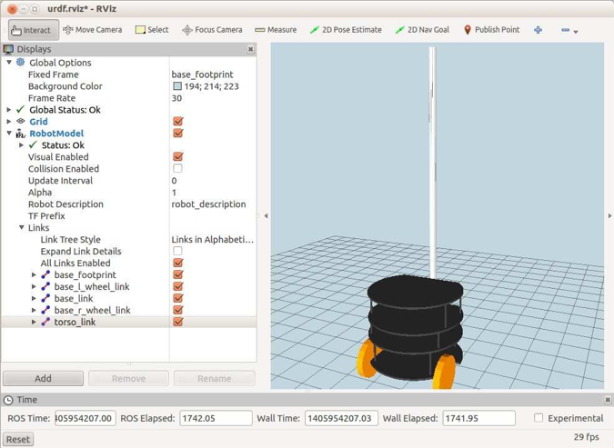

# 4.3.4 Добавление сетчатого туловища к сетчатому основанию

Добавление сетчатого туловища к остальной части Pi Robot - то же самое, что мы сделали для Box Robot. Чтобы посмотреть, как он выглядит, запустите следующий файл запуска:

```text
$ roslaunch rbx2_description pi_robot_with_torso.launch
```

Если _RViz_ все еще не работает:

```text
$ rosrun rviz rviz -d `rospack find rbx2_description`/urdf.rviz
```

Вид в _RViz_ должен выглядеть следующим образом:



\(Не забудьте установить флажок рядом с дисплеем **RobotModel**, если RViz все еще показывает ранее загруженную модель\).

Файл URDF/Xacro верхнего уровня для этой версии Pi Robot называется _pi\_robot\_with\_torso.xacro_ в директории _rbx2\_description/urdf/pi\_robot_ и выглядит следующим образом:

```text
<?xml version="1.0"?>
<robot name="box_robot">

  <!-- Define a number of dimensions using properties --> 
  <property name="torso_offset_x" value="-0.13" /> 
  <property name="torso_offset_y" value="0.0" /> 
  <property name="torso_offset_z" value="0.088" />

  <!-- Include all component files -->
  <xacro:include filename="$(find rbx2_description)/urdf/materials.urdf.xacro" 
/>

  <xacro:include filename="$(find r
bx2_description)/urdf/pi_robot/pi_base.urdf.xacro" />

  <xacro:include filename="$(find 
rbx2_description)/urdf/pi_robot/pi_torso.urdf.xacro" />
  
  <!-- Add the base and wheels -->
  <base name="base" color="Black"/>

  <!-- Add the torso -->
  <torso name="torso" parent="base" color="Grey">
    <origin xyz="${torso_offset_x} ${torso_offset_y} ${torso_offset_z}" rpy="0 
0 0" />
   </torso>
</robot>
```

Как и в модели Box Robot, сначала мы определяем смещения туловища относительно основания. Затем включаем файл материалов и два макрофайла _mesh_, один для базы и один для туловища. Наконец, мы называем базовый макрос, за которым следует макрос туловища с параметрами _origin_ блок, установленными в нужной точке крепления.


