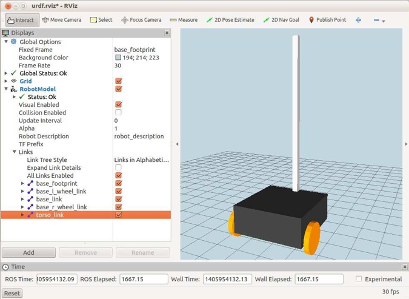

# 4.3 Добавление туловища

Теперь, когда мы заложили основу для основания и колес, добавить торс относительно просто. Давайте начнем с коробчато-цилиндрической версии. В этом случае мы добавим вертикальный столбик размером 1 x1, напоминающий секцию 8020 Т-слота. Чтобы увидеть, как это будет выглядеть, прервите все запущенные файлы запуска URDF и запустите следующий файл запуска:

```text
$ roslaunch rbx2_description box_robot_with_torso.launch
```

Если RViz еще не запущен:

```text
$ rosrun rviz rviz -d `rospack find rbx2_description`/urdf.rviz
```

Вид в RViz должен выглядеть примерно так, как на картинке ниже:



\(Не забудьте установить флажок рядом с дисплеем **RobotModel**, если вы все еще видите ранее загруженную модель.\)

Измените **Fixed Frame** обратно на _/base\_footprint_, если он все еще установлен на _/base\_link_ из предыдущего раздела.

Обратите внимание, как новый _torso\_link_ отображается в разделе Links на дисплее **RobotModel** на левой панели. Вы можете отключить отображение туловища, сняв флажок рядом с названием ссылки.


