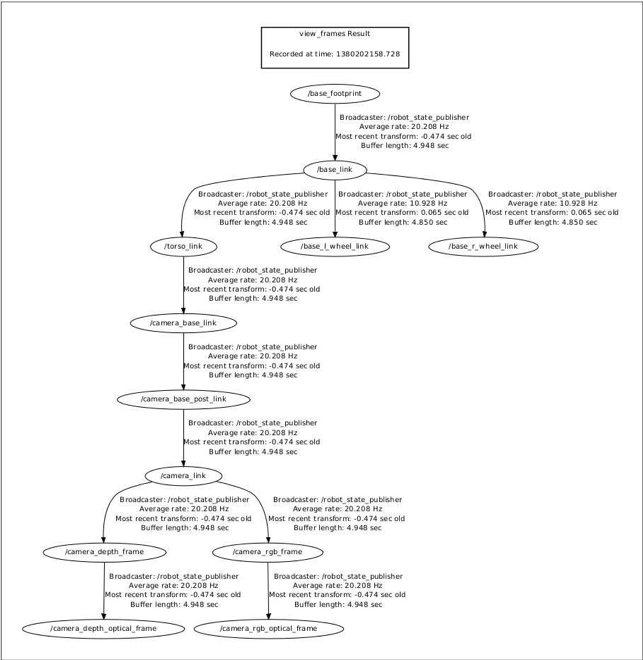

# 4.5.4 Просмотр дерева преобразований с туловищем и камерой

Трансформирующее дерево нашего робота теперь должно быть немного интереснее. Давайте посмотрим на него с помощью _view\_frame_:

```text
$ cd /tmp
$ rosrun tf view_frames
```

В результате будет создан PDF-файл под названием _frames.pdf_ в текущем каталоге. Его можно просмотреть с помощью любой программы для чтения PDF, например, _evince_:

```text
$ evince frames.pdf
```

А дерево _tf_ должно выглядеть следующим образом:



Обратите внимание, как кадр _/base\_link_ соединяется с _/torso\_link_, который, в свою очередь, соединяется с _/camera\_link_. Затем файл /camera\_link разветвляется на кадры глубины слева и кадры RGB справа. Каждая дуга представляет собой преобразование координат между смежными ссылками и не только постоянно обновляет эти преобразования в случае движения любой из ссылок, но и вычисляет преобразования между не смежными ссылками, комбинируя трансформации по пути, который их соединяет. Например, если зрительный узел ROS обнаруживает объект в кадре глубины камеры, мы можем использовать библиотеку _tf_ для получения его координат в базовом кадре.


