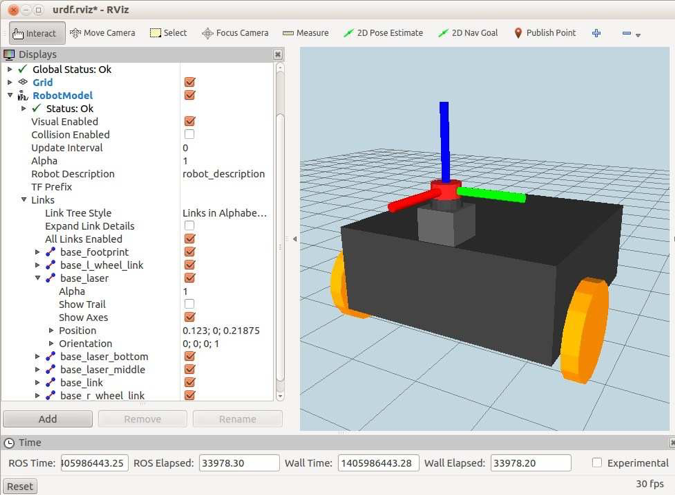

# 4.6.1 Моделирование лазерного сканера

Коробочно-цилиндровую модель лазерного сканера Hokuyo можно найти в файле _laser.urdf.xacro_ под _rbx2\_description/urdf/sensors_. Модель довольно проста, поэтому мы не будем перечислять ее здесь. Файл _box\_robot\_with\_laser.xacro_ показывает, как присоединить лазер к базе:

```text
<?xml version="1.0"?> <robot name="box_robot">
<!-- Define a number of dimensions using properties --> <property name="laser_offset_x" value="0.123" /> <property name="laser_offset_y" value="0.0" /> <property name="laser_offset_z" value="0.08" />
<!-- Include all component files -->
<xacro:include filename="$(find rbx2_description)/urdf/materials.urdf.xacro" />
          <xacro:include filename="$(find
rbx2_description)/urdf/box_robot/base.urdf.xacro" />
          <xacro:include filename="$(find
rbx2_description)/urdf/sensors/laser.urdf.xacro" />

<!-- Add the base and wheels --> 
<base name="base" color="Black"/>

<!-- Add the laser -->
<laser parent="base" color="DarkGrey">
          <origin xyx="${laser_offset_x} ${laser_offset_y} ${laser_offset_z}" rpy="0 
0 0 " />
   </laser>
</robot>
```

Чтобы посмотреть, как это выглядит в _RViz_, завершите все текущие запусковые файлы URDF и запустите:

```text
$ roslaunch rbx2_description box_robot_base_with_laser.launch
```

Если _RViz_ все еще не работает:

```text
$ rosrun rviz rviz -d `rospack find rbx2_description`/urdf.rviz
```



На изображении выше мы установили флажок Show Axes для ссылки _base\_laser_. Это позволяет нам видеть, что базовая лазерная рама расположена в середине верхнего цилиндра, и что оси ориентированы в том же направлении, что и основание. \(Помните, что красная ось находится в направлении _x_ и мы хотим, чтобы она была направлена вперед\).

Таким же образом можно добавить и другие датчики. Например, если на роботе установлен гидролокатор _Ping\(TM\)_, вы можете смоделировать его как одиночный цилиндр, а затем прикрепить эту модель к основанию так же, как мы сделали это для лазерного сканера.


