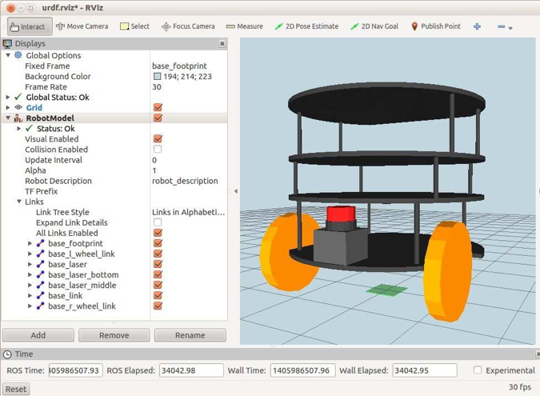

# 4.6.2 Подключение лазерного сканера \(или другого датчика\) к сетчатому основанию

Мы можем использовать тот же файл _laser.urdf.xacro_, чтобы добавить сканер в ячеистую базу Pi Robot. Файл, который делает этот трюк - _pi\_robot\_base\_with\_laser.xacro_ в каталоге _rbx2\_description/urdf/pi\_robot._ Файл почти идентичен тому, что мы использовали для Box Robot, но теперь мы включаем mesh для базы и настраиваем смещения для лазерного сканера, чтобы поместить его в нужное место. Чтобы увидеть результат, завершите файл запуска боксовой модели и запустите команду:

```text
$ roslaunch rbx2_description pi_robot_base_with_laser.launch
```

Если _RViz_ все еще не работает:

```text
$ rosrun rviz rviz -d `rospack find rbx2_description`/urdf.rviz
```

Вид в _RViz_ должен выглядеть так:




