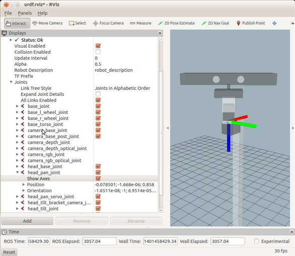

# 4.7.3 Вычисление осей вращения

Как мы узнали, что нужно выбрать отрицательное Z-образное направление для поворота панорамного сечения головы? Взгляните на изображение ниже:

Здесь мы установили значение **Alpha** для дисплея RobotModel равным _0.5_, чтобы нам было проще видеть кадры соединения и соединения. Далее мы установили **Link Tree Style** в алфавитном порядке вместо **Links** по умолчанию в алфавитном порядке. Глядя вниз по списку соединений, мы находим _head\_pan\_joint_ и ставим галочку рядом с **Show Axes**. Ссылаясь на изображение выше, мы видим, что панорамирование головки требует поворота вокруг оси _z_ \(показано синим цветом в _RViz_\), но опорная рамка инвертируется с осью _z_, направленной вниз. Следовательно, нам нужно указать ось поворота, которая будет направлена вверх \(_"0 -1 "intheURDFmodel"_\). Если вы используете правое правило и указываете большой палец вверх, то ваше Создание модели URDF для вашего робота - 134 пальцы должны скручиваться в направлении вращения головы против часовой стрелки, что является общепринятой практикой, используемой ROS для определения положительного вращения. Убедиться в том, что это так, можно, вернувшись в GUI совместного состояния и переместив ползунок _head\_pan\_joint_ в сторону увеличения значений \(т.е. вправо\). В результате головка должна панорамировать против часовой стрелки.

Этот же анализ можно применить к любому шарниру, для которого необходимо вычислить ось вращения. Сначала включите отображение осей для данного шарнира и воспользуйтесь правым правилом для определения знака оси, вокруг которой вращается шарнир. Если вы сделаете тот же анализ для _head\_tilt\_joint_, то увидите, что вращение происходит вокруг положительной оси \(_showningreeninRViz\)sowepassthevalues_ "0 1 0 "_fortheaxis_ параметра для шарнира наклона головки в нашей модели URDF.

