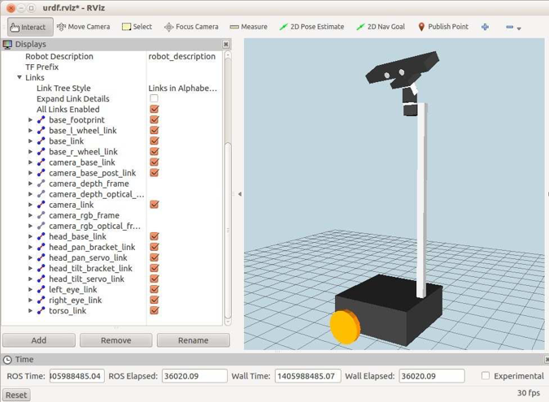

# 4.7 Добавление головки панорамирования и наклона

Размещение камеры на паре сервоприводов панорамирования и наклона может добавить много функциональности вашему роботу. Однако моделирование сервоприводов и шарниров между ними может быть немного сложным. К счастью, ребята из Willow Garage давно создали URDF/Xacro модель руки TurtleBot, которая использует те же сервоприводы Dynamixel и кронштейны, которые мы будем использовать для нашей головки с функцией панорамирования и наклона.

Для нашего Box Robot мы будем использовать простые боксы для моделирования сервоприводов и кронштейнов. Вы можете попробовать это, используя следующую команду:

```text
$ roslaunch rbx2_description box_robot_with_pan_tilt_head.launch
```

Если _RViz_ все еще не работает:

```text
$ rosrun rviz rviz -d `rospack find rbx2_description`/urdf.rviz
```

После переключения дисплея модели робота, вид должен выглядеть следующим образом:



В то же время, окно Joint State Publisher теперь будет включать в себя два новых ползунка для поворотных и откидных швов, как показано на рисунке справа. Для вышеприведенного изображения регуляторы использовались для панорамирования головы влево и наклона вниз. С подменю **Links**, расширенным под дисплеем **RobotModel**, мы можем видеть ссылки, которые составляют скобки и сервоприводы головки для поворота и наклона. 

**ПРИМЕЧАНИЕ**: Напомним, что ROS использует правое правило для рамки координат и вращения с базовой рамой ориентированный с осью _х_, направленной вперед, ось _у_ указывая влево, и ось _z_, указывающая прямо вверх. Так как мы установили туловище и камеру непосредственно на основание без каких-либо явных смещений при вращении, базовая рамка камеры и сервопривод для панорамирования также имеют свою ось _z_, направленную прямо вверх. Используя правило правой руки с большим пальцем, направленным вдоль оси _z_, и пальцами, скручивающимися в направлении вращения, мы видим, что положительное панорамирование камеры должно поворачиваться влево, что можно подтвердить с помощью ползунковых регуляторов. Аналогично, ось _y_ сервопривода наклона головы направлена влево, когда камера направлена вперед. Направляя большой палец в этом направлении, пальцы скручиваются вниз, указывая, что положительное вращение наклона должно повернуть камеру вниз, что можно еще раз подтвердить с помощью ползунковых регуляторов.


