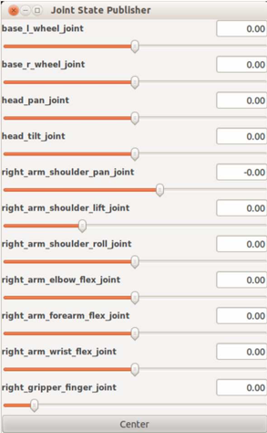
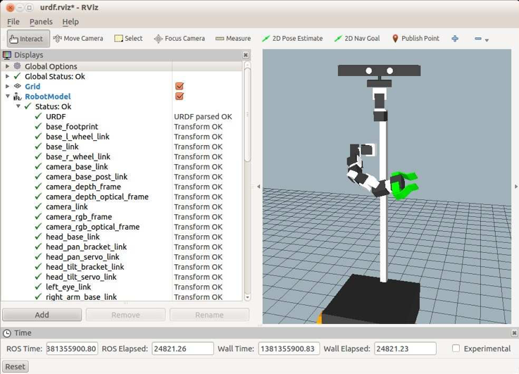

# 4.8.2 Моделирование руки

Создание URDF/Xacro для руки похоже на то, что мы уже сделали для панорамной наклонной головки. Единственная реальная разница заключается в том, что у нас больше стыков и кронштейн прикреплен к другому месту на туловище. Чтобы увидеть результат для однорукого Box Robot, запустите следующий файл запуска:

```text
$ roslaunch rbx2_description box_robot_with_arm.launch
```

If _RViz_ is not still running:

```text
$ rosrun rviz rviz -d `rospack find rbx2_description`/urdf.rviz
```

Если _RViz_ все еще работает, установите флажок **Robot Display**, чтобы обновить модель. Совместный графический интерфейс теперь должен выглядеть следующим образом:



И вид в _RViz_ должен выглядеть примерно так:



Здесь мы расположили шарниры руки, а также захват с помощью ползунка управления в состоянии сустава GUI. Чтобы сэкономить место, мы не будем перечислять все файлы URDF/Xacro для руки. Определения суставов практически такие же, как и в случае с наклонно-поворотной головкой, покрытой ранее. Ключевые файлы следующие:

* файл запуска _box\_robot\_with\_arm.launch_ загружает файл Xacro _box\_robot\_with\_arm.xacro_ из подкаталога _urdf/box\_robot_
* файл _box\_robot\_with\_arm.xacro_, в свою очередь, включает Xacro-файлы для базы, туловища, головы поворота, руки и захвата
* сама рука определяется в файле _box\_arm.urdf.xacro_
* захват определяется в файле _box\_gripper.urdf.xacro_

В файле _box\_robot\_with\_arm.xacro_ мы прикрепляем руку к туловищу, а также захват к руке со следующими двумя кодовыми блоками:

```text
<!-- Attach the right arm -->
<arm side="right" reflect="-1" parent="torso" color="White">
    <origin xyz="${arm_offset_x} ${arm_offset_y} ${arm_offset_z}" rpy="0 0 $ 
{PI/2}" />
    </arm>

<!-- Attach the right gripper -->
<gripper side="right" reflect="-1" parent="right_arm_gripper_attach" 
color="Green">
    <origin xyz="0 0 0" rpy="0 0 0" /> 
</gripper>
```

Ключевыми параметрами, которые следует отметить здесь, являются сторона и параметры отражения. Для правой руки мы устанавливаем параметр стороны на _"right"_, а параметр отражения - на _"-1"_. Эти параметры затем передаются в макросы в макросе box\_arm.urdf.xacro для присвоения каждому соединению уникального имени \(например, _right\_arm\_shoulder\_pan\_joint_ против _left\_arm\_shoulder\_pan\_joint_\) и \(опционально\) отражения любых смещений справа налево. \(Как оказалось, наши текущие модели не требуют параметра отражения, но лучше знать об этом в случае, если он необходим для другой модели\). Как мы увидим в следующем разделе, добавление второго рукава можно сделать, используя тот же файл _box\_arm.urdf.xacro_ с параметрами _side="left"_ и _reflect="1"._

Не забудьте проверить вращения шарниров плеч с помощью метода, описанного в разделе **4.7.3**. Если вы обнаружили, что определенный шарнир вращается в неправильном направлении, просто измените знак компонента оси в файле URDF/Xacro плеча.


