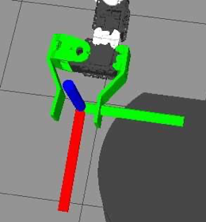

# 4.8.3 Добавление рамы захвата, запрещающей планирование

Модель руки, описанная выше, включает в себя модель для простого захвата, которая, в свою очередь, определена в файле _box\_gripper.urdf.xacro_. Этот конкретный захват имеет одну фиксированную пластину и один подвижный палец, управляемый одним сервоприводом. Когда дело доходит до захвата объекта позже в книге, мы хотим знать, где внутри захвата находится лучшее место для фактического захвата. Для этого захвата хорошая точка захвата находится между двумя пальцами в средней точке двух параллельных секций пластин, как показано на рисунке ниже:



Красная, зеленая и синяя оси расположены в нужной точке захвата и ориентированы красной осью x параллельно пальцам, синяя ось _z_ направлена вверх от плоскости захвата, а зеленая ось y направлена на левую ось захвата.

 Этот кадр захвата определяется в URDF модели захвата \(_box\_gripper.urdf.xacro_\) следующим блоком:

```text
<!-- Planning link and joint for the right gripper --> 
<joint name="${side}_gripper_joint" type="fixed">
    <origin xyz="0.05 0.0 -0.0375" rpy="${PI/2} 0 0"/> 
    <axis xyz="0 0 1" />
    <parent link="${side}_gripper_static_finger_link"/> 
    <child link="${side}_gripper_link"/>
</joint>

<link name="${side}_gripper_link"> 
    <visual>
        <origin xyz="0 0 0" rpy="0 0 0"/> 
        <geometry>
        <box size="0.001 0.0005 0.0005"/> 
        </geometry>
      </visual>
    </link>
```

Сама ссылка определяется как очень маленькое окошко, называемое _right\_gripper\_link_, а местоположение этого маленького окошка определяется _right\_gripper\_joint_, который смещает и поворачивает происхождение ссылки относительно родителя \(в данном случае _right\_gripper\_static\_finger\_link_\). Результатом является рамка захвата, расположенная и ориентированная в хорошем месте для захвата. Мы будем использовать этот кадр захвата в главе о навигации по рукам, когда речь идет о захвате объектов.

**ПРИМЕЧАНИЕ**: Использование такой виртуальной рамки захвата является необязательным и не является стандартной практикой ROS. Более распространенным является использование последней ссылки на запястье, прикрепленной к захвату, в качестве опорной рамки для планирования. Таким образом, можно поменять местами различные захваты, не оказывая большого влияния на существующее программное обеспечение для планирования. Однако добавление виртуальной рамки планирования может облегчить визуализацию и описание целей захвата относительно захвата.


