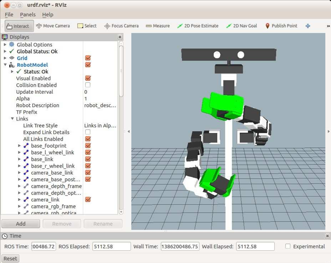

# 4.8.4 Добавление второй руки

Добавить вторую руку почти так же просто, как добавить первую руку. Файл URDF/Xacro для рукава \(_box\_arm.urdf.xacro_\) использует сторону параметров и отражает, какую сторону и ориентацию расположить руку на туловище.

Файл Xacro _box\_robot\_with\_two\_arms.xacro_ выполняет этот трюк путем добавления следующей пары макроблоков: один для правой руки и один для левой:

```text
<!-- Attach the right arm -->
<arm side="right" reflect="-1" parent="torso" color="White">
  <origin xyz="${arm_offset_x} ${arm_offset_y} ${arm_offset_z}" rpy="0 0 $ 
{PI/2}" />
  </arm>
  
  <!-- Attach the right gripper -->
  <gripper side="right" reflect="-1" parent="right_arm_gripper_attach" 
color="Green">
    <origin xyz="0 0 0" rpy="0 0 0" /> 
  </gripper>
  
  <!-- Attach the left arm -->
  <arm side="left" reflect="1" parent="torso" color="White">
    <origin xyz="${arm_offset_x} ${-arm_offset_y} ${arm_offset_z}" rpy="0 0 ${- 
PI/2}" />
  </arm>
  <!-- Attach the left gripper -->
  <gripper side="left" reflect="1" parent="left_arm_gripper_attach" 
color="Green">
  <origin xyz="0 0 0" rpy="0 0 0" /> 
</gripper>
```

Обратите внимание, что два рукава и захваты используют одни и те же макросы  и , но с противоположными значениями для параметров _side_ и _reflect_. Параметр side дает различные префиксы связей и суставов каждой руки \(например, _right\_arm\_shoulder\_lift\_joint_ против _left\_arm\_shoulder\_lift\_joint_\), а параметр reflection может использоваться для зеркального отображения смещений или направлений вращения, хотя в случае с текущими моделями рук в этом нет необходимости. Что касается способа крепления каждого плеча, обратите внимание, что y-смещение левого плеча является противоположным знаком правого плеча и поворачивается вокруг оси _z_ на 90 градусов в противоположном направлении.

Чтобы просмотреть двухручного коробчатого робота, запустите файл запуска:

```text
$ roslaunch rbx2_description box_robot_with_two_arms.launch
```

If RViz is not still running:

```text
$ rosrun rviz rviz -d `rospack find rbx2_description`/urdf.rviz
```

После переключения дисплея **RobotModel** в _RViz_ и регулировки ползунков управления, модель должна выглядеть следующим образом:



