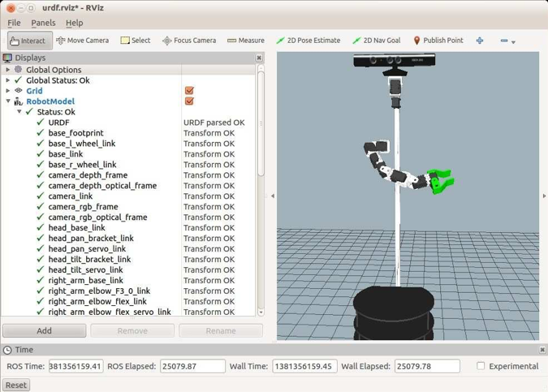

# 4.8.5 Использование сеток для рычажных сервоприводов и кронштейнов

К счастью для нас, многие уже сделали STL сетки для сервоприводов и кронштейнов Dynamixel. Так что мы можем добавить некоторые детали в руку робота, используя сетки вместо коробок. Это было сделано для модели Pi Robot с помощью следующих файлов:

* запускающий файл _pi\_robot\_with\_arm.launch_ загружает файл Xacro _pi\_robot\_with\_arm.xacro_ из подкаталога _urdf/pi\_robot_
* файл _pi\_tobot\_with\_arm.xacro_, в свою очередь, включает в себя Xacro-файлы для базы, туловища, головы поворота, руки и захвата
* сама рука определяется в файле _pi\_arm.urdf.xacro_
* захват определяется в файле _pi\_gripper.urdf.xacro_

  Чтобы увидеть результирующую модель, завершите все запущенные в настоящее время файлы запуска URDF и запустите их:

```text
$ roslaunch rbx2_description pi_robot_with_arm.launch
```

Если RViz все еще не работает:

```text
$ rosrun rviz rviz -d `rospack find rbx2_description`/urdf.rviz
```

\(Если RViz все еще работает с предыдущей сессии, установите флажок рядом с дисплеем **RobotModel**, чтобы перезагрузить модель\). Изображение должно выглядеть следующим образом:



Ниже показан крупный план компонентов сетки Dynamixel:


Вы также можете просмотреть две вооруженные версии Pi, используя файл запуска:

```text
$ roslaunch rbx2_description pi_robot_with_two_arms.launch
```


